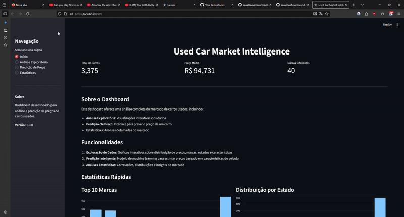

# Used Cars Market Intelligence Pipeline



This is a complete, end-to-end data science project that scrapes, processes, and predicts used car prices from OLX (a major Brazilian classifieds site). The final model is served via a FastAPI endpoint and visualized in a Streamlit dashboard.

The champion model is a **Tuned XGBoost Regressor** that achieved:

  * **Final R² (Test Set): 0.8874**
  * **Final RMSE (Test Set): 0.1980** (on log-transformed price)

-----

## Project Goal

The objective was to build a full-stack data science portfolio piece, demonstrating competence in every stage of the MLOps lifecycle:

1.  **Data Acquisition:** Dynamic web scraping (Playwright).
2.  **ETL:** Robust data cleaning and validation (Pandas).
3.  **Feature Engineering:** Creating high-signal features and handling high-cardinality categorical data.
4.  **Model Experimentation:** Systematically testing and tuning models (from baseline to XGBoost).
5.  **Productionizing:** Saving a final model pipeline and serving it with a REST API (FastAPI).
6.  **Visualization:** Building a simple UI for interaction (Streamlit).

-----

## Project Structure

The repository is structured to separate concerns, following modern MLOps practices:

```
used-car-market-intelligence/
│
├── api/                  # FastAPI application
│   ├── main.py           # API endpoints (/predict)
│   ├── model_loader.py   # Logic to load the .pkl model
│   ├── models.py         # Pydantic request/response models
│   └── run.py            # Script to run the API
│
├── dashboard/            # Streamlit dashboard
│   ├── app.py            # The dashboard UI code
│   └── run.py            # Script to run the dashboard
│
├── data/
│   ├── raw/              # Raw scraped .csv data
│   ├── processed/        # Cleaned .csv data (post-ETL)
│   └── features/         # Final feature-engineered .csv
│
├── etl/                  # ETL scripts
│   └── run.py            # Cleans raw data
│
├── feature/              # Feature engineering scripts
│   └── run.py            # Creates V1 features (car_age, etc.)
│
├── models/               # Model training & final artifacts
│   ├── run.py            # Script to train and save the FINAL model
│   └── price_predictor_v1.pkl # The CHAMPION MODEL (V4)
│
├── notebooks/            # Jupyter "Lab" for experimentation
│   ├── EDA.ipynb         # Exploratory Data Analysis
│   └── Model.ipynb       # Model V1, V2, V3, V4 experiments
│
├── scrapping/            # Playwright web scraper
│   ├── run.py            # Script to run scraping
│   └── olx_scraper.py    # Scraper implementation
│
├── pipeline.py           # Main pipeline orchestrator
└── requirements.txt      # Project dependencies
```

-----

## The Pipeline & Methodology

This project's core is the systematic iteration and improvement, as documented in the `notebooks/`.

### 1\. Scraping & ETL

  * The scraper (`scrapping/olx_scraper.py`) uses **Playwright** to handle dynamic JavaScript-loaded content on OLX, performing deep scraping to get vehicle details and optional extras.
  * The ETL script (`etl/run.py`) cleans the raw data, using Regex to extract `year` from titles and robustly parsing location data.

### 2\. Feature Engineering

  * The "lab" (`notebooks/EDA.ipynb`) identified key features.
  * `feature/run.py` creates `log_price` (to normalize the target) and `car_age` (fixing a bug for future cars, `age <= 0`, by setting them to `0.5`).
  * **Key Strategy:** To handle high-cardinality features, `state_clean` was grouped into `STATE_OTHER` (for states with \< 50 listings) and `marca` was grouped into `BRAND_OTHER` (for brands outside the Top 20).

### 3\. Model Experimentation (The "V-Series")

The `notebooks/Model.ipynb` contains the full story of our model hunt. We used `scikit-learn`'s `Pipeline` and `ColumnTransformer` to ensure no data leakage.

| Model | Features | Algorithm | Test R² | Test RMSE |
| :--- | :--- | :--- | :--- | :--- |
| **V1** | 12 (Baseline) | RandomForest | 0.8493 | 0.2291 |
| **V2** | 65 (All Features) | RandomForest | 0.8621 | 0.2191 |
| **V3** | 65 (All Features) | XGBoost (Default) | 0.8731 | 0.2102 |
| **V4** | **65 (All Features)** | **Tuned XGBoost** | **0.8874** | **0.1980** |

The V4 model was tuned with an exhaustive `RandomizedSearchCV` (**7500 total fits**) to find the optimal hyperparameters.

### 4\. The Champion Model (V4)

The final script `models/run.py` retrains this V4 model on 100% of the data using the "golden" parameters found during tuning and saves the final `price_predictor_v1.pkl`.

  * **Algorithm:** `XGBRegressor`
  * **Golden Parameters:**
      * `n_estimators`: 700
      * `max_depth`: 5
      * `learning_rate`: 0.05
      * `subsample`: 0.8
      * `colsample_bytree`: 0.8

-----

## How to Run

Follow these steps to run the full pipeline, from scraping to API.

### 1\. Installation

Clone the repository and set up the virtual environment.

```bash
# Clone the repo
git clone https://github.com/kauadaviamaro/used-car-market-intelligence.git
cd used-car-market-intelligence

# Create and activate a virtual environment
python -m venv venv
source venv/bin/activate  # (or .\venv\Scripts\activate on Windows)

# Install dependencies
pip install -r requirements.txt

# Playwright requires a one-time setup to install browsers
playwright install
```

### 2\. Run the Full Data Pipeline

**Opção A: Usando o script principal (Recomendado)**

O projeto agora inclui um script principal robusto que orquestra todo o pipeline:

```bash
# Executa todas as etapas em sequência (scraping -> etl -> features -> train)
python pipeline.py pipeline

# Ou execute etapas individuais:
python pipeline.py scraping      # Apenas scraping
python pipeline.py etl           # Apenas ETL
python pipeline.py features      # Apenas engenharia de features
python pipeline.py train         # Apenas treinamento do modelo
```

**Opção B: Executando scripts individuais**

```bash
# Step 1: Scrape the data from OLX
python scrapping/run.py

# Step 2: Clean the raw data
python etl/run.py

# Step 3: Engineer the final features
python feature/run.py

# Step 4: Train and save the champion model (V4)
python models/run.py
```

After this, you will have the `models/price_predictor_v1.pkl` file.

### 3\. Run the API

With the model file saved, you can now run the prediction API.

**Opção A: Usando o script principal**

```bash
python pipeline.py api
```

**Opção B: Executando diretamente**

```bash
# Run the FastAPI server
python api/run.py

# (Or run with Uvicorn for development)
# uvicorn api.main:app --reload
```

The API will be live at `http://127.0.0.1:8000/docs`.

### 4\. Run the Dashboard

Finally, launch the Streamlit dashboard to interact with the API.

**Opção A: Usando o script principal**

```bash
python pipeline.py dashboard
```

**Opção B: Executando diretamente**

```bash
# Run the Streamlit app
python dashboard/run.py

# Ou diretamente:
# streamlit run dashboard/app.py
```

The dashboard will be live at `http://localhost:8501`.

### 5. Run with Docker

You can also run the API and Dashboard using Docker:

```bash
# Build and start all services
docker-compose up --build

# Run in detached mode
docker-compose up -d

# Stop services
docker-compose down

# View logs
docker-compose logs -f
```

The services will be available at:
- API: `http://localhost:8000`
- Dashboard: `http://localhost:8501`

**Note:** Make sure you have the trained model file (`models/price_predictor_v1.pkl`) before running Docker containers.

### Script Principal (pipeline.py)

O script `pipeline.py` oferece uma interface unificada para executar todas as operações do projeto:

- **Validação automática**: Verifica dependências e arquivos necessários
- **Tratamento de erros**: Mensagens claras e informativas
- **Execução sequencial**: Pipeline completo com um único comando
- **Flexibilidade**: Execute etapas individuais quando necessário

Use `python pipeline.py --help` para ver todas as opções disponíveis.

**Estrutura padronizada:**
- `pipeline.py` - Script principal
- `scrapping/run.py` - Scraping
- `etl/run.py` - ETL
- `feature/run.py` - Feature engineering
- `models/run.py` - Model training
- `api/run.py` - API server
- `dashboard/run.py` - Dashboard